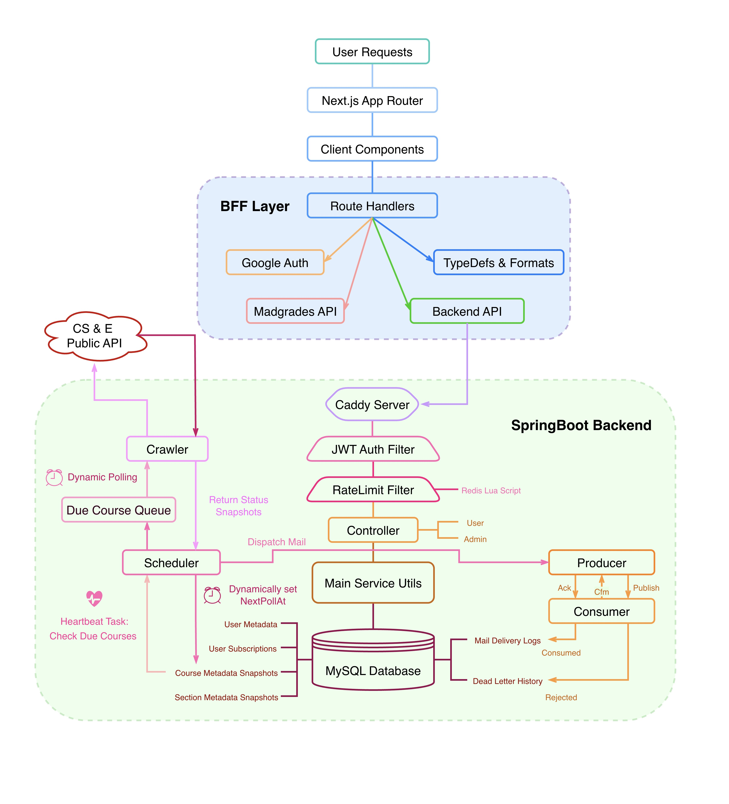

# MadEnroll

---

### A course monitor service for UW-Madison.

> [!NOTE]
> Visit MadEnroll:
> 
> [madenroll.com](https://madenroll.com)

### Project Structure：

### Tech Stack

Backend：
- Java 21
- SpringBoot 4
- MySQL
- RabbitMQ
- Redis
- Docker

Frontend：
- Next.js 16
- React 19
- TailwindCSS 4
- TypeScript

### How it works 

Subscribe courses after registering by email address. Users will receive email alerts when seats become available.

### Future

- Dockerfile Deployment
- Refine Frontend UI
- Backend Error Alert
